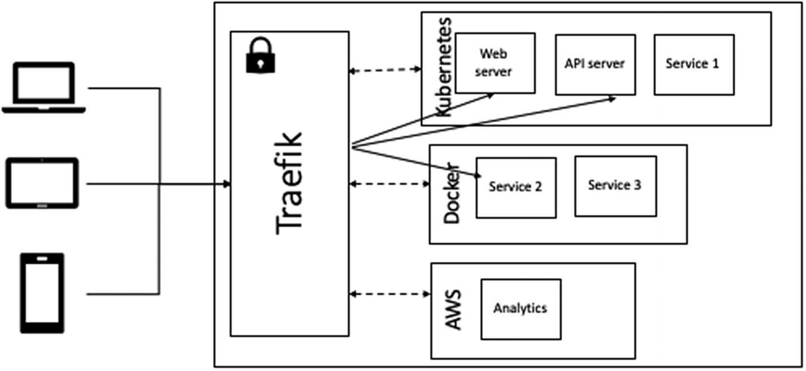
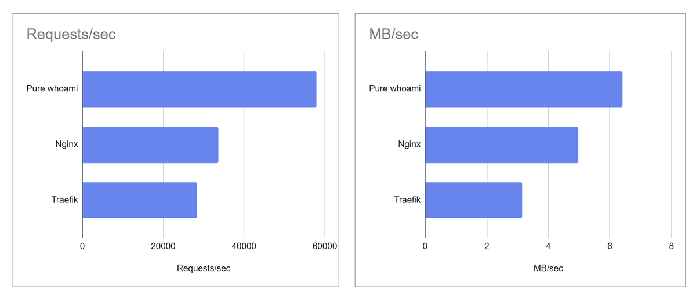

Treafik adalah cloud native router atau bisa kita bilang sebagai **API Gateway**.
Treafik dirancang untuk menyederhanakan operasi dari microservice.
Project ini ada yang opensource dan ada yang enterprise.
Project bertujuan memudahkan developer untuk mengembakan dan melakukan deploying aplikasi mereka.
 
  

Treafik support ke setiap teknologi cluster seperti Kubernetes, Docker, Mesos dan lain lain.
Semuanya punya integrasinya sendiri sendiri yang disebut sebagai provider.
Si provider ini yang nanti bertanggung jawab untuk menghubungkan si orchestration engine dan service yang berjalan diatasnya.
Dan treafik juga mampu berintergrasi dengan beberapa provider secara bersamaan.



Treafik dibangun diatas bahasa pemrograman golang. Komunitas yang membangun project ini juga cukup besar dan aktif. Mungkin jika dibandingkan dengan NGINX secara performa masih kalah sedikit. Tapi secara fitur dan dukungan ke microservice treafik lebih unggul.

  

sumber: [https://devforth.io/blog/nginx-vs-traefik-how-slower-one-can-be-better/](https://devforth.io/blog/nginx-vs-traefik-how-slower-one-can-be-better/).

Secara configurasi, trafik dibagi menjadi dua bagian **static** dan **dynamic**. Maksudnya ada konfigurasi static yang ketika ada perubahan membutuhkan restart dan ada yang bisa dikonfigurasi ketika sedang berjalan.


Static configuration bisa dibilang sebagai entrypoint tempat dimana kita set up para provider sedangkan dynamic configuration digunakan untuk setup routing, service yang berada diprovider.

## Instalasi

Untuk demo kali ini kita akan menggunakan tools yang paling basic yaitu docker dan docker-compose.

```yaml
version: "3.3"

services:

  traefik:
    image: "traefik:v2.8"
    container_name: "traefik"
    command:
      #- "--log.level=DEBUG"
      - "--api.insecure=true"
      - "--providers.docker=true"
      - "--providers.docker.exposedbydefault=false"
      - "--entrypoints.web.address=:80"
    ports:
      - "80:80"
      - "8080:8080"
    volumes:
      - "/var/run/docker.sock:/var/run/docker.sock:ro"

  whoami:
    image: "traefik/whoami"
    container_name: "simple-service"
    labels:
      - "traefik.enable=true"
      - "traefik.http.routers.whoami.rule=Host(`test.localhost`)"
      - "traefik.http.routers.whoami.entrypoints=web"
```

jalankan `docker-compose up -d` dan hasilnya kita bisa mendeploy dashboard treafik dengan mengakses `http://localhost:8080` dan aplikasi `whoami` di  `http://test.localhost`.

Schema:

- [https://json.schemastore.org/traefik-v2.json](https://json.schemastore.org/traefik-v2.json)
- [https://json.schemastore.org/traefik-v2-file-provider.json](https://json.schemastore.org/traefik-v2-file-provider.json)


