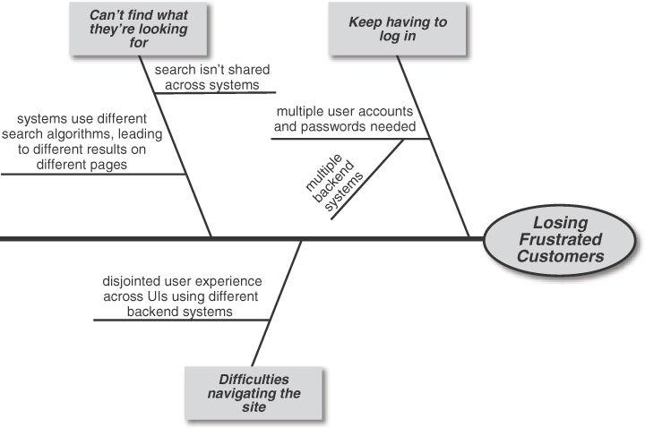
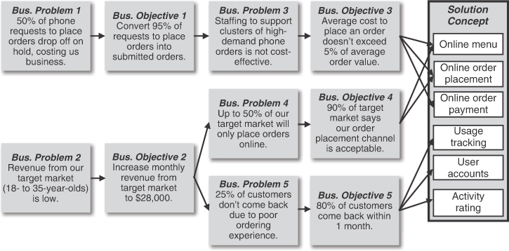

## Chapter 2. Laying the Foundation

Dalam model pengembangan software waterfall (kelasik murni dan hipotetis), tim mengumpulkan satu set lengkap kebutuhan untuk produk, merancang solusi, membangun seluruh solusi, mengujinya, dan mengirimkannya. Kita semua tahu bahwa pendekatan tersebut tidak berhasil dengan baik dalam kebanyakan kasus.

Proyek-proyek akan bervariasi dalam sejauh mana pekerjaan kebutuhan dapat, dan seharusnya, dilakukan di awal. Kadang-kadang memungkinkan untuk menentukan sebagian besar kebutuhan untuk sistem informasi sebelum terlalu jauh terlibat dalam implementasi. Produk yang kompleks dengan komponen hardware dan software yang banyak menuntut rekayasa kebutuhan yang hati-hati karena biaya untuk melakukan perubahan pada tahap akhir sangat tinggi. Untuk aplikasi yang berubah dengan cepat atau dapat secara bertahap merilis versi software yang semakin canggih, mengembangkan kebutuhan tepat waktu dalam jumlah kecil adalah pendekatan yang efektif. Aplikasi inovatif mungkin melibatkan eksplorasi konsep yang banyak, pembuatan prototipe, studi kelayakan, dan penilaian pasar.

Tidak ada pendekatan tunggal terhadap siklus hidup pengembangan atau pekerjaan kebutuhan yang secara optimal sesuai dengan setiap situasi. Namun, ada beberapa kegiatan yang saling terkait terkait dengan kebutuhan yang harus dilakukan setiap tim di awal. Bab ini menjelaskan lima praktik penting yang secara kolektif memberikan dasar yang kokoh untuk keberhasilan teknis dan bisnis:

- Praktik #1. Memahami masalah sebelum mencapai solusi.
- Praktik #2. Menentukan tujuan bisnis.
- Praktik #3. Menentukan batasan solusi.
- Praktik #4. Mengidentifikasi dan menggambarkan stakeholder.
- Praktik #5. Mengidentifikasi para pengambil keputusan yang berwenang.
  
### Praktik #1. Memahami masalah sebelum mencapai solusi

Bayangkan jika Anda bekerja selama lebih dari satu tahun pada sebuah proyek yang mendapatkan dukungan eksekutif dan memiliki tingkat visibilitas yang tinggi. Sebagai seorang analis bisnis, Anda melakukan penggalian, analisis, dan spesifikasi kebutuhan. Tim pengembangan membangun apa yang diminta oleh para stakeholder dan menerapkan produk tersebut sesuai jadwal. Namun, hanya dalam waktu tiga bulan, produk tersebut dianggap gagal dan ditarik. Mengapa hal ini terjadi? Karena produk tersebut tidak berhasil memecahkan masalah yang tepat.

Terlalu sering, tim membangun dan merilis kebutuhan, fitur, dan bahkan produk secara keseluruhan yang tidak digunakan karena **tim tersebut tidak sepenuhnya memahami situasi bisnis dan masalah yang ingin mereka selesaikan**. Memahami masalah atau peluang yang akan diselesaikan oleh solusi Anda akan menyelaraskan semua peserta pada isu-isu inti dan memberikan keyakinan bahwa solusi tersebut benar-benar akan mencapai hasil yang diinginkan.

#### **Masalah Bisnis**

Masalah bisnis adalah setiap isu yang mencegah bisnis mencapai tujuannya atau memanfaatkan peluang (Beatty dan Chen 2012). Masalah bisnis dapat bersifat kecil, seperti keluhan pengguna bahwa suatu tugas memakan waktu terlalu lama, yang mungkin dapat diselesaikan dengan menyederhanakan beberapa fungsionalitas. Atau masalah bisnis dapat bersifat besar seperti tantangan bisnis tingkat organisasi—terlalu banyak pengeluaran, pendapatan yang tidak mencukupi, atau kerugian yang mengharuskan proyek besar atau produk baru secara keseluruhan.

Organisasi meluncurkan inisiatif untuk memecahkan satu atau lebih masalah bisnis. Setiap kegiatan dibiayai karena manajemen mengharapkan nilai bisnisnya melebihi biaya yang dikeluarkan. Namun, masalah atau peluang tersebut seringkali tidak secara eksplisit dinyatakan atau didokumentasikan. Alih-alih menyajikan pernyataan masalah yang jelas, sponsor eksekutif atau pelanggan utama mungkin hanya memberi tahu tim apa yang harus dibangun. Hal ini dapat menyebabkan skenario seperti yang dijelaskan di atas: keberhasilan proyek namun kegagalan produk. Jika Anda tidak memahami masalah dengan cukup baik, atau jika Anda mulai dengan solusi tertentu dalam pikiran, ada kemungkinan besar bahwa tim hanya akan menyelesaikan sebagian dari masalah tersebut—atau mungkin tidak menyelesaikan sama sekali.

Sebaiknya hindari menganggap bahwa masalah yang disajikan atau solusi yang disajikan selalu benar. Presentasi awal tersebut mungkin berasal dari analisis bisnis, piagam proyek, manajer senior, atau pemimpin visi produk. Namun, apakah Anda bisa mempercayainya sebagai arahan yang tepat untuk semua pekerjaan yang akan dilakukan selanjutnya?

Ketika Anda dihadapkan dengan masalah yang diungkapkan, lakukan root cause analysi sampai Anda yakin bahwa masalah yang sebenarnya dan faktor-faktor yang berkontribusi sudah dipahami dengan baik (Tableau 2022). Kemudian Anda dapat menghasilkan solusi yang mungkin untuk menangani masalah-masalah tersebut. Jika Anda dihadapkan dengan sebuah solusi, jelajahi pertanyaan ini: "Jika `<solusi>` adalah jawabannya, apa pertanyaannya?" Dengan kata lain, tanyakan "Mengapa Anda berpikir itu adalah solusi yang tepat?" Anda mungkin menemukan bahwa masalah mendasar membutuhkan pendekatan yang berbeda: mungkin lebih sederhana, mungkin lebih kompleks, mungkin lebih spesifik, mungkin lebih umum. Anda tidak akan tahu sampai Anda melakukan analisis.

#### **Menggali Masalah Sebenarnya**

Seorang stakeholder mungkin meminta solusi seperti "Menggabungkan beberapa sistem menjadi satu", dengan harapan bahwa strategi seperti itu akan menangani beberapa tujuan yang tidak ditentukan. Namun, penggabungan sistem bisa terlalu berlebihan jika ada solusi yang lebih sederhana yang lebih tepat. Jika masalahnya adalah Anda menghabiskan terlalu banyak uang untuk pemeliharaan dan dukungan empat sistem yang ada, menggabungkannya bisa menjadi pendekatan yang tepat. Namun, bayangkan jika masalah yang paling mendesak adalah pengguna yang tidak puas. Root cause analysis dengan menggunakan teknik "5 Whys" dengan stakeholder yang relevan dapat memilah semuanya (Tableau 2022).

Root cause analysis melibatkan bekerja mundur dari masalah yang diungkapkan atau solusi yang diajukan untuk mengidentifikasi masalah-masalah mendasar dan faktor-faktor yang berkontribusi terhadapnya. Menilai faktor-faktor tersebut kemudian mengarah pada pilihan solusi yang tepat. Dengan teknik "5 Whys", Anda bertanya seperti "Mengapa itu menjadi masalah?" atau "Mengapa kita belum mencapai tujuan itu saat ini?" secara berulang hingga Anda menemukan isu yang mendasar yang mendorong diluncurkannya inisiatif tersebut. Percakapan antara seorang analis bisnis dan stakeholder utama mungkin berjalan seperti ini:

Analis: "Anda meminta kita menggabungkan empat sistem yang Anda miliki menjadi satu. Mengapa kita perlu menggabungkannya?"

Stakeholder: "Karena pelanggan kami mengeluh bahwa mereka harus terus masuk kembali antara setiap kali mengklik halaman situs. Ini menjengkelkan. Ini terjadi karena mereka mengakses sistem backend yang berbeda dan semuanya memiliki akun pengguna terpisah."

Analis: "Mengapa itu menjadi masalah jika pelanggan Anda mengeluh?"

Stakeholder: "Menurut penelitian pasar kami, 25 persen dari pelanggan kami meninggalkan kami karena frustrasi dengan ketergunaan situs kami."

Analis: "Jika demikian, mengapa tidak hanya menerapkan fitur single sign-on (SSO) untuk meningkatkan usability?"

Stakeholder: "Itu akan membantu, tetapi kami masih harus memelihara dan mendukung keempat sistem tersebut."

Analis: "Jika kita menggabungkannya, apakah Anda masih memerlukan jumlah orang yang sama untuk mendukung sistem baru tersebut?"

Stakeholder: "Kami tidak berpikir begitu. Keempat sistem saat ini menggunakan bahasa pemrograman yang berbeda. Kami memerlukan setidaknya satu insinyur yang fasih dalam setiap bahasa untuk mendukung setiap sistem, meskipun tidak cukup pekerjaan untuk membuat mereka sibuk. Dengan menggabungkan sistem-sistem tersebut menjadi satu menggunakan satu bahasa, kami dapat membebaskan insinyur tambahan untuk bekerja pada produk lain."

Analis: "Ah, jadi tampaknya Anda mencoba memecahkan beberapa masalah. Anda ingin meningkatkan retensi pelanggan, dan Anda juga ingin mengurangi biaya dukungan dan membebaskan staf dengan menggunakan lebih sedikit teknologi."

Dengan menanyakan "mengapa" beberapa kali dalam percakapan ini, analis sekarang memahami bahwa stakeholder mengharapkan solusi yang diajukan untuk menangani dua masalah yang signifikan. Permintaan untuk menggabungkan beberapa sistem menjadi satu mungkin memang menjadi strategi terbaik dalam jangka panjang. Namun, solusi sementara menggunakan single sign-on (SSO) dapat mengatasi kekecewaan pelanggan dengan cepat, sementara inisiatif konsolidasi bekerja pada masalah yang lebih besar terkait dukungan dan pemeliharaan.

Diagram root cause analysis, juga disebut diagram tulang ikan atau diagram Ishikawa, adalah cara untuk menunjukkan hasil analisis tersebut. Misalkan BA menelusuri masalah pertama yang dibawa oleh stakeholder: kehilangan pelanggan yang frustrasi. BA dapat menerapkan teknik "5 Whys" untuk mengetahui dengan pasti mengapa pelanggan merasa frustrasi dan kemudian menggambar diagram seperti yang ditunjukkan di Gambar 2.1. Masalah tersebut berada di kepala "ikan". Tempatkan penyebab tingkat tinggi pada kotak-kotak pada garis diagonal yang keluar dari tulang belakang ikan. Tambahkan penyebab berkontribusi pada garis horizontal pendek dari setiap diagonal. Lanjutkan eksplorasi sampai Anda mencapai akar penyebab yang paling mendasar dan dapat diterapkan. Kemudian Anda dapat merancang satu atau lebih solusi untuk mengatasinya.

Ada garis horizontal dengan permasalahan yang disajikan, yaitu kehilangan pelanggan yang frustrasi, dalam bentuk oval di ujung kanan. Garis diagonal keluar dari garis horizontal tersebut dan dalam kotak-kotak menunjukkan penyebab tingkat pertama: harus terus melakukan login, kesulitan menavigasi situs, tidak dapat menemukan yang dicari. Garis horizontal yang keluar berupa garis diagonal menunjukkan penyebab tingkat lebih rendah, dan seterusnya.
Gambar 2.1 Contoh diagram root cause analysi (tulang ikan atau Ishikawa) menunjukkan faktor-faktor yang berkontribusi pada masalah yang disajikan.



Setelah Anda mengidentifikasi isu-isu utama dan faktor-faktor yang berkontribusi, pertimbangkan semua implikasinya sebelum menentukan sebuah solusi. Solusi yang diminta atau paling jelas mungkin bukanlah strategi yang tepat. Pada salah satu proyek Candase, masalahnya adalah versi commercial off-the-shelf (COTS) yang digunakan perusahaan akan segera habis masa dukungannya dan vendor tidak akan lagi memberikan dukungan. Setelah itu, masalah produksi apa pun dapat mengancam bisnis perusahaan karena tidak akan ada bantuan dari vendor. Perusahaan juga tidak dapat melakukan perbaikan sendiri pada produk vendor saat ini. Solusi yang jelas adalah meningkatkan ke versi terbaru dari produk vendor. Namun, perusahaan harus membayar biaya layanan yang tinggi kepada vendor untuk memecahkan masalah dan menambahkan fitur baru. Oleh karena itu, perusahaan mempertimbangkan opsi untuk mendapatkan paket COTS baru dari vendor lain atau membangun pengganti internal sebagai solusi yang lebih baik untuk masalah awal yang berhubungan dengan berakhirnya masa dukungan serta masalah tambahan.

Analisis masalah dapat mengungkap tantangan-tantangan lain yang tidak terlihat. Anda mungkin dihadapkan pada masalah yang saling bertentangan dari stakeholder yang berbeda atau mencoba menyelesaikan beberapa masalah yang berbeda dengan satu solusi. Saat Anda menjelajahi isu-isu tersebut, cari situasi di mana Anda mungkin memerlukan beberapa solusi, daripada mencari satu solusi sempurna.

#### **Mempertahankan Fokus pada Masalah Bisnis**

Ketika para stakeholder utama telah sepakat untuk memahami dengan jelas masalah inti bisnis, pertimbangkan untuk menulis pernyataan masalah (Kyne 2022). Template seperti ini bisa membantu (Compton 2022):

| type      | definisi                                                                    |
|-----------|-----------------------------------------------------------------------------|
| Situasi   | Jelaskan latar belakang, konteks, dan lingkungan.                           |
| Masalah   | Jelaskan masalah bisnis atau peluang sebagaimana yang Anda pahami saat ini. |
| Implikasi | Jelaskan hasil yang kemungkinan terjadi jika masalah tidak diselesaikan.    |
| Manfaat   | Tuliskan nilai bisnis dari penyelesaian masalah tersebut.                   |
| Visi      | Jelaskan seperti apa kondisi masa depan yang diinginkan.                    |

Pernyataan masalah yang ringkas berfungsi sebagai titik referensi untuk seluruh pekerjaan selanjutnya. Hal ini langsung berhubungan dengan merumuskan tujuan bisnis spesifik yang diharapkan oleh manajemen atau pelanggan terhadap solusi (lihat Praktik #2, "Tentukan tujuan bisnis"). Pernyataan masalah juga membantu tim dalam membuat keputusan sepanjang proyek. Saat memprioritaskan kebutuhan, berikan keutamaan pada item yang merupakan kontributor kritis atau tepat waktu dalam menyelesaikan masalah dengan nilai tertinggi (lihat Praktik #13, "Prioritaskan kebutuhan"). Dalam contoh menggabungkan beberapa sistem menjadi satu di atas, menerapkan single sign-on (SSO) untuk mengatasi kekecewaan pelanggan akan menjadi solusi yang lebih cepat daripada menggabungkan beberapa sistem dan akan menangani kekhawatiran segera tentang kehilangan pelanggan.

Setiap kali seseorang meminta kemampuan baru sistem, tanyakan bagaimana hal tersebut berkaitan dengan masalah bisnis (lihat Praktik #20, "Kelola perubahan kebutuhan secara efektif"). Jika Anda tidak dapat mengaitkan setiap kebutuhan baru dengan salah satu masalah bisnis yang sudah ditetapkan, mungkin ada masalah lain yang perlu dijelajahi atau Anda tidak memerlukan kebutuhan baru tersebut.

Stakeholders seringkali akan mengusulkan suatu hasil spesifik sebagai kebutuhan: "Bangunlah produk X atau fitur Y untuk saya." Solusi yang diajukan oleh stakeholder mungkin memang benar—tetapi tidak selalu. **Luangkan waktu untuk sepenuhnya memahami masalah bisnis yang sebenarnya untuk memastikan bahwa tim fokus pada pencapaian hasil yang tepat**. Jika analisis Anda mengungkapkan bahwa masalah yang sebenarnya tidak sepenuhnya cocok dengan apa yang Anda temukan dalam kasus bisnis atau dokumen awal lainnya, ubah dokumen tersebut agar sesuai dengan realitas yang baru dipahami. Wawasan ini dapat mengubah arah proyek secara signifikan.

Praktik Terkait

- Praktik #2. Tentukan tujuan bisnis.
- Praktik #3. Tentukan batasan solusi.
- Praktik #13. Prioritaskan kebutuhan.
- Praktik #20. Kelola perubahan kebutuhan secara efektif.

#### **Langkah Selanjutnya**

1. Jika Anda belum melakukannya, bicarakan dengan kepemimpinan proyek dan stakeholder utama tentang alasan mereka melakukan inisiatif Anda untuk memastikan bahwa Anda memahami masalah yang hendak dipecahkan.
2. Buatlah diagram root cause analysi untuk masalah bisnis inti Anda, menggunakan teknik seperti "5 Whys" untuk menemukan penyebab-penyebab utama dan berkontribusi.
3. Tulis pernyataan masalah menggunakan template yang dijelaskan dalam bagian ini.
4. Berdasarkan masalah atau masalah yang diidentifikasi, evaluasilah apakah konsep solusi saat ini akan menyelesaikannya dengan memadai. Jika tidak, entah ubah solusi atau tunjukkan risiko bahwa solusi saat ini mungkin tidak memadai.

#### **Ringkasan**

Untuk menghindari kegagalan dalam mengembangkan suatu proyek, penting bagi tim untuk memahami dengan baik masalah yang ingin dipecahkan sebelum menetapkan solusi. Terlalu sering, tim membangun dan merilis kebutuhan, fitur, atau bahkan produk secara keseluruhan yang tidak digunakan karena mereka tidak sepenuhnya memahami situasi bisnis dan masalah yang ingin mereka selesaikan. Dengan memahami masalah atau peluang yang akan diatasi oleh solusi yang diusulkan, semua peserta akan memiliki pemahaman yang sama tentang isu inti dan keyakinan bahwa solusi tersebut memang akan mencapai hasil yang diinginkan.

### Praktik #2. Menentukan tujuan bisnis

Memahami masalah dan peluang bisnis merupakan langkah awal yang penting dalam memastikan tim berfokus pada masalah yang tepat. Langkah selanjutnya adalah mendeskripsikan dengan tepat apa yang diharapkan oleh sponsor proyek atau stakeholder penting lainnya dari solusi yang akan dicapai. **Jika seseorang bertanya mengapa tim Anda bekerja pada inisiatif tertentu, Anda harus memiliki jawaban yang baik.**

Beberapa orang menggunakan istilah kebutuhan bisnis untuk merujuk pada setiap kebutuhan, termasuk potongan fungsionalitas yang diminta, yang berasal dari bisnis, tetapi itu bukan cara kami menggunakan istilah tersebut. Kami merujuk pada informasi yang menjelaskan mengapa organisasi memutuskan untuk melakukan proyek dan nilai yang mereka harapkan dapat dicapai (Wiegers and Beatty 2013). Elemen inti dari kebutuhan bisnis meliputi pernyataan tentang peluang dan tujuan bisnis, metrik keberhasilan, dan pernyataan visi. Mengartikulasikan kebutuhan bisnis merupakan langkah penting dalam mencapai keselarasan di antara semua stakeholder untuk menciptakan solusi yang tepat.

#### **Kebutuhan Bisnis**

Sebuah organisasi melakukan inisiatif untuk menciptakan atau memanfaatkan peluang bisnis, memenuhi kebutuhan bisnis, atau memecahkan masalah bisnis. Kebutuhan bisnis yang jelas membangun berdasarkan pernyataan masalah untuk menentukan hasil bisnis yang diinginkan, mengidentifikasi indikator yang akan memberi tahu kita ketika masalah tersebut terpecahkan, dan banyak lagi. Kebutuhan bisnis muncul di bagian atas model kebutuhan seperti yang ditunjukkan pada Gambar 1.1. Mereka memberikan petunjuk panduan untuk semua pekerjaan yang mengikuti. Jika sebuah proyek atau produk tidak memenuhi kebutuhan bisnisnya, seseorang telah menyia-nyiakan banyak waktu, uang, dan upaya.

Kebutuhan bisnis dapat berasal dari seorang eksekutif yang memahami masalah, pelanggan utama yang mengenali kebutuhan, atau seorang pemimpin visi produk yang melihat peluang pasar. Orang-orang seperti itu mungkin sudah memiliki kasus bisnis untuk inisiatif tersebut, tetapi mereka masih mungkin menemukan nilai untuk bekerja dengan BA untuk menyusun kumpulan kebutuhan bisnis yang lebih lengkap.

Jika Anda menemukan diri Anda memfasilitasi diskusi untuk menjelajahi penggerak bisnis dan pembenarannya dari sebuah proyek, ingatlah bahwa tujuan pada tahap tersebut bukanlah untuk mengumpulkan daftar fungsi yang diinginkan yang luas. Sebaliknya, kebutuhan bisnis berfokus pada mengapa meluncurkan proyek ini atau membangun produk itu adalah ide yang baik. Pertanyaan-pertanyaan berikut dapat memicu diskusi yang menghasilkan informasi relevan (Business Analysis Excellence, n.d., Wiegers 2006). Situs web untuk buku ini menawarkan unduhan dengan pertanyaan-pertanyaan ini, dan yang lainnya, dalam bentuk checklist.

- Masalah bisnis apa yang Anda coba selesaikan atau peluang bisnis apa yang Anda rasakan?
- Apa motivasi untuk memecahkan masalah ini atau mengejar peluang ini, atau apa poin-poin yang menyakitkan yang Anda harapkan bisa teratasi?
- Apa tujuan bisnis Anda? Mengapa Anda belum mencapai hasil yang diinginkan?
- Bagaimana produk yang diusulkan akan memberikan nilai bagi organisasi, perusahaan, pelanggan Anda, atau kemanusiaan secara keseluruhan?
- Apa yang akan menjadi solusi yang sangat sukses bagi Anda? Bisakah Anda mengkuantifikasi potensi keuntungannya?
- Bagaimana Anda dapat menilai kesuksesan solusi tersebut?
- Apa dampak bisnis yang mungkin terjadi jika Anda tidak mengejar solusi ini?
- Individu, kelompok, produk, sistem, atau proyek mana yang dapat mempengaruhi atau terpengaruh oleh proyek ini?
- Apa tujuan atau batasan waktu untuk memberikan solusi sebagian? Solusi lengkap?
- Jika organisasi sebelumnya tidak berhasil memecahkan masalah ini, mengapa upaya tersebut gagal dan apa yang seharusnya dilakukan tim kali ini?
- Apa asumsi yang Anda buat mengenai inisiatif yang diusulkan? Apa risiko yang Anda lihat terkait dengan itu?

Kebutuhan bisnis mencakup beberapa jenis informasi. Banyak tim software membuat dokumen visi dan ruang lingkup yang berisi kebutuhan bisnis menggunakan template yang mirip dengan yang ditunjukkan pada Gambar 2.2 (Wiegers and Beatty 2013). Tim lain mungkin menyimpan informasi tersebut dalam piagam proyek, menggunakan template seperti yang ditunjukkan pada Gambar 2.3 (Wiegers 2007). Kedua template, dengan teks panduan yang disematkan, tersedia untuk diunduh dari situs web yang menyertai buku ini. Jawaban-jawaban atas pertanyaan-pertanyaan di atas memungkinkan Anda mengisi berbagai bagian dari template-template ini.


Template ini menunjukkan kategori untuk kebutuhan bisnis, ruang lingkup dan batasan, serta konteks bisnis. Di bawah kebutuhan bisnis terdapat kategori seperti masalah atau peluang bisnis, tujuan bisnis, metrik keberhasilan, pernyataan visi, dan risiko bisnis. Ruang lingkup dan batasan memiliki subkategori untuk fitur utama, ruang lingkup rilis awal dan berikutnya, batasan dan pengecualian. Konteks bisnis memiliki kategori untuk profil stakeholder, prioritas proyek, dan pertimbangan implementasi.

Template ini memiliki kategori untuk deskripsi proyek, tujuan bisnis dan kriteria keberhasilan, stakeholder, visi, ruang lingkup proyek, asumsi dan ketergantungan, batasan, tonggak waktu, risiko bisnis, dan sumber daya.

Organisasi yang menciptakan produk software komersial sering menulis dokumen persyaratan pasar yang dapat mencakup informasi bisnis ini. Dan setiap organisasi dapat menulis kasus bisnis untuk membenarkan investasi dalam inisiatif baru. Seperti yang ditunjukkan oleh penulis analisis bisnis Steven Blais (2012):

Semua dokumen ini memiliki tujuan yang sama: untuk memberikan informasi yang diperlukan bagi seseorang untuk membuat keputusan untuk memecahkan masalah bisnis ini sekarang, nanti, atau tidak sama sekali. Tujuan keseluruhan dari kasus bisnis adalah untuk meminimalkan risiko dalam pengambilan keputusan.

#### **Tujuan Bisnis**

Tujuan bisnis memungkinkan Anda menentukan kapan sebuah masalah bisnis terpecahkan, kebutuhan terpenuhi, atau peluang dimanfaatkan. Tujuan bisnis dapat bersifat keuangan atau nonkeuangan, internal (operasional) atau berorientasi ke luar (produk), strategis atau taktis. Meskipun lebih mudah menyatakan tujuan yang samar, Anda harus menulis tujuan Anda agar spesifik, realistis, dan dapat diukur. Jika tidak, Anda tidak dapat mengetahui apakah Anda telah mencapainya.

Menetapkan target dalam bentuk tujuan bisnis memungkinkan para pengambil keputusan mendefinisikan ruang lingkup pekerjaan yang diperlukan untuk mencapai tujuan tersebut. Tujuan- tujuan tersebut membantu memastikan bahwa solusi meliputi semua fungsionalitas yang diperlukan sambil menghindari fitur yang tidak relevan yang tidak berkontribusi pada hasil bisnis yang diinginkan.

Menentukan tujuan bisnis secara awal mengarah pada pembuatan konsep solusi. Konsep tersebut kemudian mengarah pada kegiatan untuk menentukan fitur-fitur dan atribut-atribut spesifik solusi, suatu proses yang disebut elicitation kebutuhan. Misalkan Anda memiliki ide hebat untuk produk baru yang inovatif. Anda ingin segera memulai konstruksi, mungkin dengan membuat prototipe proof-of-concept. Eksplorasi tersebut berharga, tetapi sebelum Anda mulai membangun produk secara nyata, luangkan waktu untuk memikirkan mengapa Anda ingin membangunnya dan apa yang ingin Anda capai: tujuan bisnis Anda.

Pendekatan yang paling sederhana adalah dengan mencantumkan tujuan yang Anda harapkan setiap solusi penuhi:

Mengembangkan bisnis digital dari ~$1Miliar menjadi $10Miliar dalam pendapatan dengan marjin 50 hingga 75 persen pada tahun 2030.

Mengurangi waktu rata-rata yang dihabiskan untuk penyimpanan dan penemuan dokumen dari 10 jam menjadi 2 jam per karyawan per minggu.

Lebih baik untuk mengkuantifikasi tujuan dengan menyatakan tujuan mutlak, daripada perubahan persentase relatif terhadap titik awal yang sekarang (Beatty and Chen 2012). Sebagai contoh, daripada ini:

> Meningkatkan pangsa pasar di wilayah Australasia sebesar 20 persen dalam 6 bulan.

nyatakan sesuatu seperti ini:

> Mencapai pangsa pasar minimal 45 persen di wilayah Australasia pada tanggal 1 Oktober 2024.

Perubahan relatif sulit untuk dinilai jika nilai acuan dasar, tanggal, atau metode pengukuran tidak secara tepat dinyatakan dan dicatat.

Model Tujuan Bisnis memungkinkan analisis yang lebih mendalam untuk masalah-masalah kompleks. Diagram ini adalah salah satu dari banyak yang ada di RML, bahasa pemodelan persyaratan yang dikembangkan oleh Joy Beatty dan Anthony Chen (2012). Model tujuan bisnis menghubungkan masalah-masalah bisnis dengan tujuan bisnis, metrik keberhasilan yang terkait, dan konsep solusi yang dihasilkan (ArgonDigital 2022). Deskripsi ringkas tentang cara membuat model tujuan bisnis tersedia dari situs web yang terkait dengan buku ini. Gambar 2.4 mengilustrasikan model tujuan bisnis parsial untuk sistem pemesanan online restoran hipotetis yang dirancang untuk melengkapi pemesanan telepon. Kita akan melihat lebih banyak tentang sistem ini seiring kita melanjutkan.

Modeling ini sangat berharga ketika Anda memiliki masalah-masalah bisnis dan tujuan yang saling terkait: Satu masalah mengarah pada tujuan, yang mengarah pada masalah yang lebih rinci, yang mengarah pada tujuan lain, dan seterusnya, seperti yang ditunjukkan di Gambar 2.4. Model RML yang lebih canggih, disebut objective chain, menghubungkan fitur-fitur solusi yang diusulkan secara kuantitatif dengan tujuan bisnis (Beatty dan Chen 2012). Objective chain membantu Anda menganalisis fitur-fitur mana yang akan memberikan nilai terbesar bagi bisnis atau pengguna solusi dan oleh karena itu kemungkinan yang paling penting untuk diimplementasikan lebih dulu.



Diagram ini menunjukkan beberapa masalah bisnis dalam persegi panjang, masing-masing diikuti oleh tujuan bisnis yang sesuai. Misalnya, masalah bisnis 1 mengatakan "50% permintaan telepon untuk melakukan pemesanan terputus saat menunggu, menyebabkan kami kehilangan bisnis." Tujuan bisnis 1 mengatakan, "Konversi 95% permintaan untuk melakukan pemesanan menjadi pemesanan yang terkirim." Jaringan masalah bisnis dan tujuan yang saling terhubung mengarah pada konsep solusi dengan fitur-fitur termasuk menu online, penempatan pemesanan online, pembayaran pemesanan online, pelacakan penggunaan, dan akun pengguna.

#### **Metrik Keberhasilan**

Metrik keberhasilan memungkinkan Anda menilai kemajuan dan kontribusi solusi Anda terhadap tujuan Anda. Dalam beberapa kasus, tujuan itu sendiri dapat diukur secara langsung. Tujuan bisnis yang disebutkan sebelumnya - "Mencapai pangsa pasar setidaknya 45 persen di wilayah Australasia pada 1 Oktober 2024" - adalah salah satu dari itu, asalkan Anda dapat melacak pangsa pasar Anda sebagai fungsi waktu.

Namun, banyak tujuan bisnis adalah indikator tertinggal (Anda tidak dapat yakin sampai akhir) dan kemungkinan dipengaruhi oleh faktor-faktor di luar solusi Anda. Dalam situasi ini, Anda harus menggunakan metrik yang menjadi pengganti atau petunjuk yang menunjukkan apakah solusi Anda berada di jalur yang tepat untuk mencapai tujuan bisnis secara keseluruhan.

Jika tujuan Anda pada tahun 2023 adalah untuk meningkatkan pendapatan menjadi $10 miliar pada tahun 2030, Anda tidak akan tahu dengan pasti apakah Anda telah mencapainya selama tujuh tahun ke depan. Bahkan jika Anda mencapai tujuan tersebut, setidaknya sebagian pertumbuhan dapat disebabkan oleh kegiatan pemasaran atau penjualan baru daripada produk Anda. Metrik keberhasilan interim, seperti jumlah pelanggan baru atau ukuran pesanan rata-rata, adalah indikator yang dapat memberi Anda keyakinan bahwa solusi Anda sedang melakukan apa yang Anda harapkan. Pastikan tren dalam metrik pengganti yang Anda pilih - indikator pelacakan - sebanding dengan apa yang ingin Anda capai.

#### **Visi Produk**

Pernyataan visi - komponen lain dari persyaratan bisnis - menetapkan target strategis tingkat tinggi untuk menyelaraskan semua peserta proyek menuju hasil yang sama. Pernyataan visi dengan singkat merangkum niat utama solusi (Wiegers dan Beatty 2013). Dalam beberapa kalimat, pernyataan visi mengartikulasikan inti dari masalah, sifat solusi yang diusulkan, fitur-fitur tingkat tinggi, dan manfaat inti bagi stakeholder tertentu.

Kadang-kadang orang menggabungkan visi dan ruang lingkup, tetapi keduanya berbeda. Kami berpikir dalam hal visi produk - yang mungkin tidak pernah tercapai sepenuhnya - dan ruang lingkup proyek yang mendefinisikan bagian dari visi utama mana pun yang ingin diwujudkan oleh proyek atau siklus pengembangan tertentu. Bersama-sama dengan tujuan bisnis, pernyataan visi menjelaskan bagaimana beberapa aspek dunia akan menjadi lebih baik dengan produk baru ini: siapa target pasar, apa produknya, mengapa lebih baik daripada situasi saat ini, dan sebagainya. Template kata kunci sederhana ini membantu dalam menulis pernyataan visi (Moore 2014):

| type        | definition                                                                                                              |
|-------------|-------------------------------------------------------------------------------------------------------------------------|
| For         | [target customers]                                                                                                      |
| Who         | [statement of the business need or opportunity]                                                                         |
| The         | [name of the product or project]                                                                                        |
| Is          | [jenis produk atau proyek]                                                                                              |
| That        | [kemampuan produk utama; manfaat inti yang akan diberikan; alasan yang kuat untuk membeli produk atau melakukan proyek] |
| Unlike      | [kenyataan bisnis saat ini, produk alternatif, atau persaingan]                                                         |
| Our product | [ringkasan singkat keunggulan utama produk ini dibandingkan dengan kenyataan saat ini atau persaingan]                  |

Template ini membantu orang memikirkan elemen-elemen pernyataan visi dan menulisnya dalam pola yang konsisten dan singkat. Sebagai contoh, berikut adalah pernyataan visi yang kami tulis untuk buku ini, dengan kata kunci template ditebalkan miring.

Bagi analis bisnis, manajer produk, pemilik produk, insinyur persyaratan, perwakilan pengguna, pengembang, pengujian, dan anggota tim lain yang bertanggung jawab untuk pengembangan dan manajemen persyaratan, Software Requirements Essentials adalah sebuah buku kompak yang dengan ringkas menjelaskan dua puluh praktik inti persyaratan yang semua proyek software dan sistem harus terapkan. Setiap praktik diringkas secara efisien dengan gaya pragmatis yang memungkinkan pembaca untuk dengan cepat memahami mengapa hal itu penting dan bagaimana memulai menerapkannya.

Tidak seperti banyak teks yang lebih panjang dan komprehensif tentang persyaratan dan analisis bisnis yang mencakup puluhan teknik dalam ratusan halaman, produk kami adalah sebuah buku pendek dan sangat mudah dibaca yang fokus pada hanya dua puluh praktik inti dalam area membangun dasar proyek yang sukses dan pengumpulan persyaratan, analisis, spesifikasi, validasi, dan manajemen. Kelebihan singkat dan fokus ini meningkatkan daya tarik bagi praktisi yang sibuk, yang dapat dengan cepat menemukan bimbingan yang berguna yang mereka butuhkan, beserta petunjuk ke sumber-sumber lain untuk detail lebih lanjut.

(Sebagai pembaca - pelanggan kami - Anda adalah hakim terakhir apakah kami berhasil mencapai visi ini!)

Membuat pernyataan visi adalah kegiatan kolaboratif, karena semua orang harus selaras dengan visi produk. Namun, alih-alih meminta beberapa stakeholder untuk menyusun pernyataan visi bersama, lebih baik jika mereka menulis pernyataan visi mereka secara independen menggunakan template ini dan kemudian membandingkan hasilnya. Latihan ini dapat mengungkap perbedaan terminologi, tujuan yang saling bertentangan, penekanan pada komunitas pengguna yang berbeda, dan masalah batas solusi yang harus dipecahkan oleh para peserta.

Saat anggota tim membuat keputusan tak terhitung jumlahnya tentang pekerjaan mereka dari waktu ke waktu, mereka harus tetap memperhatikan pernyataan masalah, tujuan bisnis, metrik keberhasilan, dan pernyataan visi. Solusi yang diimplementasikan harus memberikan nilai yang memungkinkan organisasi mencapai tujuan bisnisnya. Persyaratan bisnis yang jelas dan komunikatif menetapkan panggung bagi setiap proyek teknologi informasi untuk memberikan hasil yang diharapkan.

#### **Praktik Terkait**

- Praktik #1. Memahami masalah sebelum menuju pada solusi.
- Praktik #3. Mendefinisikan batasan solusi.
- Praktik #4. Mengidentifikasi dan menggambarkan stakeholder.
- Praktik #6. Memahami apa yang dibutuhkan oleh pengguna dari solusi.

#### **Langkah Selanjutnya**

- Jika Anda belum memiliki, undang stakeholder utama yang mendorong proyek untuk mencapai kesepakatan tentang pernyataan visi.
- Jika organisasi Anda belum memiliki, usulkan template untuk dokumen persyaratan bisnis (atau "kontainer") yang disesuaikan dengan kebutuhan dan sifat proyek Anda. Jika Anda sudah memiliki template, bandingkan dengan konten yang ditunjukkan dalam Gambar 2.2 dan 2.3 dan lakukan penyesuaian yang sesuai.
- Bekerja dengan individu yang tepat untuk merumuskan beberapa tujuan bisnis yang kuantitatif dan dapat diverifikasi untuk proyek Anda. Konfirmasikan bahwa pekerjaan yang sedang berlangsung atau direncanakan sejalan dengan mencapai tujuan-tujuan tersebut.
- Tentukan metrik keberhasilan untuk setiap tujuan bisnis yang akan mengungkapkan apakah solusi sedang bergerak ke arah mencapai tujuan-tujuan tersebut.
- Jika Anda memiliki beberapa masalah bisnis dan tujuan yang saling terkait, gambarlah model tujuan bisnis untuk menunjukkan hubungan mereka.

##### contoh implementasi untuk auth service

| type        | definition                                                                                                                                                                |
|-------------|---------------------------------------------------------------------------------------------------------------------------------------------------------------------------|
| For         | product engineers                                                                                                                                                         |
| Who         | need to provide effortless authentication for all eFishery digital ecosystem services                                                                                     |
| The         | auth service                                                                                                                                                              |
| Is          | a centralized authentication solution                                                                                                                                     |
| That        | provides seamless and secure authentication for all eFishery digital ecosystem services, improving developer experience and allowing them to focus on their core business |
| Unlike      | developing separate authentication services for each individual service                                                                                                   |
| Our product | streamlines the authentication process, ensuring consistent security measures and reducing development time                                                               |

#### **ringkasan**

Pemahaman akan masalah dan peluang bisnis adalah langkah pertama yang penting dalam memastikan tim fokus pada masalah yang tepat. Langkah selanjutnya adalah menjelaskan dengan jelas apa yang diharapkan oleh sponsor proyek atau stakeholders penting lainnya terhadap tujuan solusi. Memiliki jawaban yang baik jika seseorang bertanya mengapa tim Anda bekerja pada inisiatif tertentu sangatlah penting.

### Praktik #3. Menentukan batasan solusi

Practice #3, "Mendefinisikan batasan solusi," mengarahkan kita untuk menentukan dengan jelas di mana batasan solusi harus ditarik. Ketika memulai inisiatif baru, kita memiliki dana untuk memecahkan satu atau lebih masalah bisnis dan konsep solusi secara umum. Namun, kita mungkin tidak tahu secara pasti di mana harus menentukan batas antara apa yang harus dan tidak harus termasuk dalam solusi. Langkah penting dalam membangun dasar yang sukses adalah menetapkan batasan "apa yang masuk dan apa yang keluar". Selain itu, kita perlu mengetahui perubahan apa yang diperlukan dalam lingkungan solusi yang akan datang dan di mana perubahan tersebut harus dilakukan. Pertanyaan-pertanyaan berikut dapat membantu kita menyelesaikan semua hal itu.

- Proses bisnis, fungsi, dan acara bisnis mana yang akan menjadi bagian dari solusi? Manakah yang akan tetap di luar solusi?
- Siapa yang akan menggunakan atau mendapatkan manfaat dari solusi? Siapa yang terkecuali?
- Sistem software mana yang akan menjadi bagian dari solusi? Bagaimana antarmukanya akan terlihat?
- Dimana tanggung jawab setiap sistem dimulai dan berakhir?
- Set data, sumber, dan operasi mana yang akan diintegrasikan ke dalam solusi?
- Bagaimana cara kita menyelaraskan solusi kita dengan seluruh jagat raya kita?
- Bagaimana kita tahu kapan harus berhenti?

Menjawab pertanyaan-pertanyaan tersebut memungkinkan BA untuk dengan jelas memvisualisasikan dan mengartikulasikan sistem software, komponen hardware, dan operasi manual mana yang berada dalam lingkup solusi yang dipilih.

#### **Refining the Solution Concept**

Untuk menentukan batasan solusi, BA dan tim harus merinci konsep solusi yang dimaksud dari sekedar konsep atau daftar fitur menjadi pernyataan yang jelas tentang apa yang akan mereka bangun atau tingkatkan. Di mana kita menarik batas solusi akan bergantung pada tujuan bisnis dan preferensi dalam hal proses manual versus otomatisasi yang relatif terjangkau (Robertson and Robertson 2013).

Misalnya, jika proyek kita adalah mengimplementasikan kemampuan pemesanan online untuk sebuah restoran. Dalam keadaan saat ini, restoran hanya memiliki dua sistem informasi: repositori menu dan sistem pemesanan. Seorang pelanggan memberikan pesanannya secara verbal kepada seorang karyawan restoran baik melalui telepon maupun langsung. Karyawan kemudian memasukkan pesanan ke dalam sistem pemesanan. Sistem pemesanan memeriksa repositori menu untuk memastikan bahwa semua item dalam pesanan tersedia. Jika ya, sistem pemesanan akan menghasilkan tiket untuk para koki di dapur untuk menyiapkan pesanan. Dalam kasus pesanan untuk dibawa pulang, karyawan yang mengambil pesanan memberikan perkiraan waktu kapan makanan akan siap kepada pelanggan. Saat ini, tidak ada pelacakan status pesanan.

Keadaan masa depan yang diinginkan akan mencakup pemesanan online, tetapi itu bisa berarti beberapa hal. Solusi menyeluruh memungkinkan pelanggan untuk memesan secara online dan menerima makanan—tetap konsisten terlepas dari sejauh mana otomatisasi yang kita implementasikan. Minimal, kita perlu memperkenalkan satu sistem baru: situs pemesanan online. Dari situs tersebut, kita dapat menentukan batasan solusi dengan beberapa cara yang mungkin.

1. Solusi yang paling sederhana adalah proses yang sebagian besar manual, di mana pelanggan mengirimkan pesanan secara online, yang kemudian dikirimkan ke karyawan restoran yang memasukkannya ke dalam sistem pemesanan yang ada saat ini.

2. Solusi semi otomatis dapat memungkinkan pelanggan memesan makanan secara online dan kemudian mengirim pesanan tersebut ke sistem pemesanan restoran. Namun, pelanggan tidak akan dapat membayar secara online atau menerima pembaruan status pesanan setelah pesanan ditempatkan.

3. Solusi otomatisasi penuh yang ideal akan memungkinkan pelanggan memesan semua item menu secara online, secara dinamis memperbarui menu saat item dibeli, memungkinkan pembayaran dan pemesanan online ke restoran, menerima permintaan pengiriman, dan memberikan pembaruan pesanan kepada pelanggan. Ini akan melibatkan sistem tambahan selain situs pemesanan online inti: pemrosesan pembayaran, layanan pengiriman, dan pelacakan pesanan.

Batasan solusi yang kita pilih akan didasarkan pada tujuan bisnis, visi produk, kendala (seperti persyaratan keamanan untuk pembayaran online), jadwal, dan pendanaan. Pertimbangkan untuk meminta stakeholders kunci untuk menggambarkan "sesuatu" terkecil yang harus diimplementasikan yang akan memenuhi tujuan mereka. Dengan merinci konsep solusi awal yang sederhana menjadi deskripsi yang lebih lengkap, kita dapat menentukan sejauh mana solusi yang tetap manual dan sejauh mana akan diotomatisasi melalui sistem baru atau yang sudah ada.

Batasan solusi yang jelas membantu tim dalam mengevaluasi permintaan fitur baru untuk menentukan ke sistem mana fitur tersebut harus dimasukkan, jika ada. Untuk skenario restoran, pernyataan solusi yang ringkas adalah: "Proses pemesanan dan pembayaran online otomatisasi penuh dengan integrasi layanan pengiriman pihak ketiga dan pelacakan pesanan otomatis."

#### Mengatur Konteks

Setelah BA merinci konsep solusi, mereka harus menempatkan setiap sistem baru dalam lingkungan software yang sudah ada di perusahaan. Mulailah dengan dokumentasi yang tersedia, seperti katalog sistem atau diagram arsitektur sistem (Lucidchart 2022a). Dari sana, BA dapat membuat diagram konteks untuk setiap sistem baru yang dibangun (Weilkiens 2007, Wiegers and Beatty 2013). Gambar 2.5 menunjukkan diagram konteks sebagian untuk situs pemesanan online baru restoran. Diagram konteks dimulai dengan sistem yang menjadi fokus ditampilkan dalam sebuah lingkaran di tengah diagram. Lingkaran tersebut mewakili batas sistem. Diagram konteks tidak memberikan wawasan tentang detail internal sistem tersebut, hanya ling kungannya yang langsung.

Seorang pelanggan akan berinteraksi dengan situs pemesanan online untuk melihat item menu, memilih beberapa item untuk membangun pesanan, dan menempatkan pesanan mereka dengan metode pembayaran yang valid. Untuk menerapkan otomatisasi penuh yang diinginkan, kita perlu mengintegrasikan situs pemesanan online baru dengan repositori menu yang sudah ada dan sistem pemesanan restoran. Selain itu, kita perlu terhubung dengan sistem eksternal untuk pemrosesan pembayaran online. Tampilkan semua entitas eksternal yang akan berinteraksi dengan sistem pusat dalam kotak di luar lingkaran. Terakhir, diagram konteks menunjukkan aliran data antara setiap entitas dan sistem menggunakan panah yang disebut aliran. Beri label setiap aliran dengan deskripsi tingkat tinggi tentang data yang dikirimkan, seperti item menu, informasi pembayaran, dan sebagainya.

Diagram konteks membatasi lingkup satu sistem, yang dapat mencakup operasi otomatis dan manual. Entitas eksternal di luar lingkaran bukan bagian dari sistem tersebut, meskipun mereka dapat dibangun sebagai bagian dari proyek yang sama. Setiap sistem eksternal akan memiliki diagram konteksnya sendiri untuk menunjukkan batas sistem dan lingkungan. Saat proyek berlanjut dan harapan rilis menjadi lebih dipahami, BA mungkin menemukan lebih banyak entitas eksternal yang akan terhubung ke sistem tersebut.

Seperti teknik BA lainnya, diagram konteks adalah alat yang berguna untuk berinteraksi dengan stakeholders dan mencapai pemahaman yang sama dan akurat. Diagram yang dihasilkan memformalkan batasan sistem; membuat atau meninjau secara kolaboratif dapat mengungkapkan masalah potensial dan membantu memecahkan kesalahpahaman.


Di tengah halaman terdapat lingkaran yang diberi label Situs Pemesanan Online. Di sekeliling lingkaran terdapat 4 kotak yang mewakili entitas eksternal yang terhubung dengan sistem pusat tersebut. Kotak-kotak tersebut diberi label pelanggan, repositori menu, sistem pemesanan restoran, dan pemrosesan pembayaran online. Panah-panah menghubungkan kotak-kotak tersebut dengan situs pemesanan online pusat. Sebagai contoh, item menu mengalir dari repositori menu ke sistem, dan pembaruan menu mengalir dari sistem ke repositori menu.

#### **Mengembangkan Ekosistem**

Diagram konteks mengidentifikasi kelas pengguna, hardware, dan sistem lain yang berinteraksi dengan sebuah produk. Namun, diagram tersebut hanya menunjukkan hubungan langsung antara sistem yang menjadi fokus kita dan entitas eksternal tersebut. Peta ekosistem melampaui konteks langsung dari satu sistem tunggal (Beatty and Chen 2012). Peta ini menggambarkan pandangan solusi secara keseluruhan, termasuk semua sistem dalam domain aplikasi tertentu—atau bahkan seluruh perusahaan—bersama dengan aliran data tingkat tinggi antara mereka. Peta ekosistem membantu kita memahami dampak yang kita berikan pada data yang sistem-sistem tersebut pertukarkan, baik di hulu maupun hilir.

Gambar 2.6 menunjukkan peta ekosistem untuk contoh pemesanan online restoran. Peta tersebut menunjukkan bahwa solusi yang diinginkan dengan otomatisasi penuh melampaui situs pemesanan online baru dan koneksi langsungnya. Solusi juga akan melibatkan perbaikan pada sistem pemesanan restoran yang sudah ada untuk terintegrasi dengan sistem pelacakan pesanan baru dan aplikasi pengiriman pihak ketiga eksternal.


Situs pemesanan online ditampilkan dalam sebuah kotak. Ia terhubung dengan sistem lain yang ditampilkan dalam kotak-kotak yang diberi label repositori menu, sistem pemesanan restoran, dan pemrosesan pembayaran online. Panah-panah menunjukkan aliran data antara kotak-kotak tersebut, seperti pada diagram konteks. Sistem pemesanan restoran terhubung dengan kotak-kotak tambahan dan seterusnya untuk menunjukkan lingkungan di mana sistem pusat situs pemesanan online kita berada.

Untuk membuat peta ekosistem, pertama-tama daftarkan sistem-sistem dalam domain solusi kita. Jika kita tidak memiliki daftar sistem lengkap, mulailah dengan sistem yang kita fokuskan dan koneksi langsungnya. Dari situ, perhatikan setiap sistem yang terhubung dan koneksi tambahan mereka, dengan menampilkan setiap sistem dalam sebuah kotak. Lanjutkan ke luar hingga kita mencakup seluruh domain solusi.

Selanjutnya, teliti sistem-sistem untuk menentukan mana yang bertukar data. Cari integrasi sinkron (panggilan API) dan asinkron (berbasis pesan), serta koneksi berbasis file dan langsung ke database. Hubungkan sistem-sistem yang saling terkait dengan panah yang menunjukkan arah aliran data, seperti pada diagram konteks.

Lengkapi peta ekosistem dengan deskripsi tingkat tinggi tentang data yang dibagikan melalui setiap koneksi. Menggabungkan peta ekosistem dengan diagram konteks menunjukkan siapa yang menggunakan sistem target dan pandangan keseluruhan multi-sistem. Peta ekosistem memiliki potensi penggunaan kembali yang baik untuk proyek dan produk yang berbeda dalam sebuah organisasi.

Dengan menerapkan batasan solusi, BA dan tim akan memiliki nilai tambah sepanjang kehidupan proyek untuk definisi ruang lingkup, definisi rencana produk, dan perencanaan rilis. Solusi yang luas dengan otomatisasi pemesanan online penuh bisa memakan waktu berbulan-bulan untuk diselesaikan. Dalam proyek iteratif, tim akan memecah implementasi penuh menjadi serangkaian rilis atau pengembangan bertahap, masing-masing menyediakan bagian yang berguna dari solusi keseluruhan. Strategi ini memungkinkan bisnis untuk mulai mencapai tujuannya sebelum seluruh fungsionalitas selesai.

Untuk menarik pelanggan yang hanya akan melakukan pemes

anan secara online dengan cepat, rilis pertama tim mungkin hanya mencakup pembangunan situs pemesanan online dan integrasinya dengan repositori menu dan sistem pemesanan yang sudah ada. Pelanggan masih harus mengambil dan membayar pesanan secara langsung. Rilis-rilis selanjutnya akan secara bertahap menambahkan fungsionalitas ke proses pemesanan online secara keseluruhan. Tabel 2.1 menunjukkan bagaimana solusi keseluruhan dapat direalisasikan melalui beberapa pengembangan bertahap dan rilis produk.

Tabel 2.1 Tujuan rilis contoh

| Release | Release objective                                                                                                 |
|---------|-------------------------------------------------------------------------------------------------------------------|
| 1       | Build online ordering site and integrate it with existing menu repository and restaurant order placement systems. |
| 2       | Add online payment processing to permit payment at time of order placement.                                       |
| 3       | Implement order tracking and integrate with third-party delivery services.                                        |
| 4       | Provide automated order and delivery updates to the customer.                                                     |

Analisis setiap interface dalam peta ekosistem atau diagram konteks membantu mengungkapkan kebutuhan dan batasan interface eksternal. Sebagai contoh, sistem pengiriman pihak ketiga kemungkinan memiliki interface teknis yang telah ditentukan yang harus dipenuhi oleh semua pengguna. Antarmuka tersebut membatasi cara sistem pemesanan pesanan dapat terintegrasi dengan produk pengiriman pihak ketiga.

Ketika muncul kebutuhan baru, gunakan visi produk, tujuan bisnis, dan batasan solusi untuk menentukan apakah setiap kebutuhan yang diminta seharusnya diimplementasikan. Misalkan kita menerima permintaan untuk mengintegrasikan sistem pemesanan pesanan dengan satu atau lebih sistem pemesanan pihak ketiga. Berdasarkan batasan solusi saat ini, kemampuan tersebut berada di luar ruang lingkup. Hal itu dapat didanai melalui proyek terpisah. Sebagai alternatif, manajemen dapat memilih untuk memperluas ruang lingkup proyek ini untuk mengatasi kebutuhan tambahan tersebut, dengan memberikan sumber daya dan waktu ekstra yang diperlukan (ini hanya lelucon kecil yang kami suka buat).

Batasan solusi yang jelas dan model koneksi membantu BA menjelaskan kebutuhan fungsionalitas tertentu. Misalnya, seseorang mungkin bertanya mengapa situs pemesanan online perlu memperbarui repositori menu, seperti yang ditunjukkan dalam Gambar 2.6. Karena sistem pemesanan pesanan memperbarui repositori menu saat persiapan makanan, apakah situs pemesanan online juga perlu melakukannya?

Jika situs pemesanan tidak memperbarui repositori menu segera setelah pelanggan melakukan pemesanan, menu di situs web akan tidak terbarui, meskipun hanya sesaat, tanpa pengetahuan tentang tingkat persediaan saat ini. Misalkan seseorang memesan satu item yang terakhir, membuatnya tidak tersedia meskipun makanannya belum disiapkan. Jika repos

itori menu tidak diperbarui segera, pelanggan lain bisa saja memesan item yang sama tapi tidak menerimanya, yang akan membuat mereka kesal. (Karl pernah mengalami ini; dia kesal). Dengan menggunakan tujuan bisnis, batasan solusi, dan peta ekosistem, BA dapat mempertahankan alasan mengapa setiap kebutuhan harus ada dalam solusi.

Kita juga dapat menggunakan batasan solusi untuk memutuskan komponen produk mana yang harus menguasai setiap bagian fungsionalitas. Menetapkan kebutuhan dengan tepat kepada sistem, sub-sistem, dan orang adalah penting baik untuk sistem informasi bisnis maupun produk kompleks yang mencakup elemen hardware dan software. Menganalisis masukan dan keluaran data menunjukkan sistem atau fungsi mana yang menghasilkan objek data tertentu dan yang mengonsumsinya.

Dengan merinci konsep solusi menjadi satu set komponen dan batasan, BA dapat memastikan bahwa ruang lingkup solusi—termasuk pengembangan baru, peningkatan, integrasi, dan operasi manual—dapat dipahami dengan baik dan dikomunikasikan kepada semua stakeholders.

Praktik Terkait

- Praktik #2. Mendefinisikan tujuan bisnis.
- Praktik #8. Mengevaluasi konsep dan hubungan data.

Langkah Selanjutnya

- Jika belum melakukannya, bekerjalah dengan stakeholders untuk memastikan bahwa semua orang memahami batasan solusi yang tim sedang buat. Acuannya adalah tujuan bisnis dan identifikasi perubahan minimal yang diperlukan untuk mencapai tujuan tersebut.

- Buatlah diagram konteks dan peta ekosistem untuk mendapatkan gambaran lengkap tentang komponen dan batasan solusi kita. Cari contoh-contoh yang sudah ada dari artefak tersebut yang dapat diperbarui sesuai kebutuhan.

- Gunakan diagram konteks dan peta ekosistem untuk mengevaluasi fungsionalitas yang diminta saat ini. Pastikan bahwa permintaan tersebut sesuai dengan proyek saat ini berdasarkan batasan solusi yang telah ditentukan. Jika tidak, tunda permintaan tersebut untuk proyek mendatang atau perjelas batasan solusi.

- Periksa peta ekosistem untuk mengidentifikasi kelompok atau sistem yang tidak terhubung langsung dengan produk kita tetapi dapat memerlukan perubahan karena data yang kita pertukarkan dengan sistem terkait lainnya. Bekerja dengan pemilik sistem terhubung tersebut untuk memastikan bahwa semua orang memahami dan setuju dengan perubahan yang diperlukan.

#### ringkasan

Practice #3, "Mendefinisikan batasan solusi," adalah tentang pentingnya menetapkan batasan solusi dalam mengembangkan inisiatif baru. Dalam praktek ini, tim perlu mengidentifikasi apa yang termasuk dan tidak termasuk dalam solusi, serta menentukan perubahan apa yang diperlukan dalam lingkungan solusi yang akan datang. Pertanyaan-pertanyaan penting seperti proses bisnis, fungsi, acara, dan sistem perangkat lunak apa yang akan menjadi bagian dari solusi harus dijawab. Hal ini membantu tim untuk memvisualisasikan dan mengkomunikasikan ruang lingkup solusi kepada stakeholders. Selain itu, dalam praktek ini juga disebutkan bahwa solusi yang diusulkan harus diperinci dari konsep umum menjadi pernyataan yang jelas tentang apa yang akan dibangun atau ditingkatkan.

### Praktik #4. Mengidentifikasi dan menggambarkan stakeholder

Setiap proyek memiliki orang-orang yang peduli terhadapnya: stakeholders. Stakeholders adalah individu atau kelompok yang secara aktif terlibat dalam proyek, terpengaruh olehnya, atau dapat memengaruhi arahnya. Minat semua stakeholders saling berpotongan dalam aktivitas kebutuhan (Wiegers 2022).

Konsultan dan penulis Tim Lister menggambarkan keberhasilan proyek sebagai "memenuhi himpunan semua kebutuhan dan batasan yang diharapkan oleh stakeholders utama." Stakeholders tersebut memberikan informasi yang diperlukan oleh BA untuk memahami masalah atau peluang bisnis. Stakeholders yang tepat dapat menggambarkan kondisi saat ini dan perubahan yang diperlukan untuk beralih ke kondisi masa depan yang lebih baik. Masukan mereka memungkinkan seorang BA untuk mendefinisikan kemampuan dan karakteristik dari solusi yang tepat dan memvalidasi solusi yang diusulkan.

Penting untuk mengidentifikasi kelompok stakeholders yang signifikan dalam proyek sejak awal dan menentukan cara terbaik untuk berinteraksi dengan mereka. Mengabaikan stakeholders dapat menyebabkan kesenjangan kebutuhan atau batasan yang tidak diketahui yang dapat mengganggu ketika mereka akhirnya ditemukan. Beberapa stakeholders menentukan arah proyek dan memiliki kewenangan atas keputusan-keputusan penting. Orang lain tidak memberikan masukan apa pun; mereka hanya menerima apa yang mereka terima. Sebagian besar kelompok stakeholders berada di antara ekstrem ini dalam spektrum pengaruh dan keterlibatan. Penting untuk mengidentifikasi stakeholders yang paling terlibat dalam membuat berbagai keputusan (lihat Praktek #5, "Identifikasi pembuat keputusan yang berwenang").

Hanya mengidentifikasi dan menggambarkan kategori stakeholders Anda tidak cukup. Anda juga harus memilih perwakilan yang tepat dari kelompok-kelompok tersebut untuk berpartisipasi dalam aktivitas kebutuhan. Namun, masalah stakeholders dapat menyebabkan masalah kebutuhan. Peran yang terlewat, peserta yang absen, dan pengganti yang tidak efektif dapat menyebabkan kesalahan kebutuhan yang harus diperbaiki nanti dengan biaya yang lebih besar.

#### **Mengejar Stakeholders**

Objektif bisnis dan pernyataan visi proyek memberikan titik awal dalam pencarian stakeholders Anda. Kalimat pertama dari contoh pernyataan visi dari Praktek #2, "Tentukan objektif bisnis," dimulai sebagai berikut:

**Bagi** analis bisnis, manajer produk, pemilik produk, insinyur kebutuhan, perwakilan pengguna, pengembang, penguji, dan anggota tim lainnya **yang** bertanggung jawab atas pengembangan dan pengelolaan kebutuhan....

Daftar orang yang mengikuti kata kunci pembukaan **"Bagi"** adalah kumpulan stakeholders awal.

Saat Anda melanjutkan pencarian, buatlah jaringan yang luas untuk mengurangi kemungkinan terlewatnya kelompok yang signifikan. Untuk menghemat waktu, Anda dapat memulai dengan katalog stakeholders yang terakumulasi dari proyek-proyek sebelumnya. Telusuri katalog tersebut untuk melihat apakah ada kelompok yang sama yang relevan dengan proyek Anda saat ini. Membangun katalog stakeholders secara bertahap dari satu proyek ke proyek berikutnya memberikan aset yang dapat digunakan kembali yang berharga sebagai titik awal untuk waktu berikutnya. Sebuah bagan organisasi dapat membantu Anda mendeteksi stakeholders potensial lainnya.

Anda juga dapat merujuk ke daftar lengkap kategori stakeholders yang biasa untuk mencari kemungkinan, seperti yang tercantum dalam Tabel 2.2 (Wiegers dan Beatty 2013). Beberapa stakeholders ditemukan di dalam tim pengembangan, yang lain bekerja di tempat lain dalam organisasi pengembang, dan masih banyak lagi yang berada di luar organisasi pengembang.

Beberapa stakeholders mungkin lebih tertarik pada proyek itu sendiri, yang lain pada solusi yang dihasilkan oleh proyek. Misalnya, pengguna tidak begitu peduli tentang bagaimana produk dibangun jika itu memungkinkan mereka untuk bekerja dengan efisien dan tanpa banyak kekecewaan. Ketika Anda mencari stakeholders, pertimbangkan pertanyaan-pertanyaan seperti ini (Leffingwell 2011).

- Siapa yang memiliki pengaruh atau kendali atas anggaran dan jadwal proyek?
- Siapa yang dapat menggambarkan objektif bisnis proyek?
- Siapa yang akan menggunakan produk secara langsung? Tidak langsung?
- Siapa yang bertanggung jawab atas sistem atau proyek lain yang akan mempengaruhi proyek Anda atau dipengaruhi oleh proyek Anda?
- Siapa yang dapat memiliki pengaruh hukum, kepatuhan, regulasi, atau proses?
- Siapa yang mengelola hubungan bisnis dengan pelanggan, pemasok, dan kontraktor?
- Proses bisnis siapa yang akan dipengaruhi oleh sistem?
- Siapa yang diharapkan menyediakan data yang dibutuhkan oleh solusi?
- Siapa yang akan mengetahui tentang batasan proyek, produk, atau proses yang relevan?

Saat Anda mengumpulkan daftar stakeholders, minta stakeholders lain untuk memeriksanya. Mereka sering tahu tentang orang lain yang seharusnya ikut serta.

Tabel 2.2 Beberapa stakeholders proyek perangkat lunak umum dan di mana mereka mungkin ditemukan

| Location                            | Category                                                                                                                                                                        |                                                                                                                                                                                              |
|-------------------------------------|---------------------------------------------------------------------------------------------------------------------------------------------------------------------------------|----------------------------------------------------------------------------------------------------------------------------------------------------------------------------------------------|
| Development team                    | Application architect,  Business analyst,  Data analyst,  Database administrator,  Database designer,  Developer,  Documentation writer,  Hardware engineer                     | Infrastructure analyst, Product manager, Product owner, Project manager, Quality assurance, Software designer, Tester, User experience designer                                              |
| Inside the developing organization  | Company owner, Compliance, Contract manager, Development manager, Executive sponsor, Information architect, Infrastructure support, Installer, Legal, Maintainer, Manufacturing | Marketing, Operations support, People responsible for connected systems, Portfolio architect, Process analyst, Program manager, Project management office, Sales, Security analyst, Training |
| Outside the developing organization | Auditor, Beta tester, Business management, Certifier, Compliance auditor, Consultant, Contracting office, Contractor, Customer management, Direct user, General public          | Government agency, Indirect user, Materials supplier, Procurement staff, Purchaser, Regulatory body, Shareholder, Software supplier, Subject matter expert, Venture capitalist               |

#### **Stakeholders, Pelanggan, dan Kelas Pengguna**

Orang kadang-kadang menggunakan istilah stakeholders, pelanggan, dan pengguna secara bergantian. Namun, seperti yang dapat Anda lihat dari Tabel 2.2, hanya stakeholders tertentu yang merupakan pelanggan, dan hanya pelanggan tertentu yang akan menggunakan produk. Beberapa pelanggan menyajikan kebutuhan solusi, mengevaluasi produk kandidat, menyediakan data, atau mendapatkan produk tetapi tidak pernah menyentuhnya sendiri. Pengguna tidak langsung dari sistem informasi masih bisa menjadi stakeholders karena operasi bisnis melibatkan tindakan manual serta tugas komputer. Sebuah sistem perangkat lunak dapat memiliki dampak pada operasi manual tersebut. Steven Blais (2012) merujuk pada himpunan pengguna sistem dan nonpengguna yang terpengaruh secara kolektif sebagai pekerja proses.

Jangan menganggap pengguna Anda sebagai kelompok monolitik: "pengguna". Hampir setiap produk memiliki kelas pengguna yang berbeda - terkadang banyak. Anggota kelas pengguna yang berbeda mungkin berbeda dalam fitur yang mereka gunakan, tugas yang mereka lakukan, frekuensi penggunaan, lokasi, akses atau tingkat hak istimewa, tingkat pendidikan atau pengalaman, dan dalam cara lainnya. Banyak pengguna akan berinteraksi langsung dengan sistem informasi. Pengguna tidak langsung menyediakan masukan ke sistem atau menerima keluaran dari sistem tetapi tidak berinteraksi langsung dengan sistem tersebut. Kelas pengguna juga dapat berupa sistem perangkat lunak atau perangkat keras lain yang memperoleh layanan dari produk Anda.

Perlakukan setiap kelas pengguna sebagai sub kategori stakeholders yang terpisah karena BA akan perlu bekerja dengan perwakilan dari setiap kelas untuk memahami kebutuhan mereka. Sedikit tumpang tindih kebutuhan antar kelas pengguna adalah hal yang umum.

Beberapa kelas pengguna mungkin lebih diutamakan daripada yang lain karena kepentingan mereka lebih kuat sejalan dengan tujuan bisnis inisiatif (Gause dan Lawrence 1999). Kelompok-kelompok tersebut harus lebih diutamakan dalam hal keputusan tentang prioritas kebutuhan, perubahan kebutuhan yang diusulkan, dan masalah serupa. Mengidentifikasi kelas pengguna yang diutamakan membantu Anda menyelesaikan konflik prioritas dan fungsionalitas yang muncul di antara kelas-kelas tersebut.

Sebagai contoh dari berbagai kelas pengguna untuk sebuah produk, pertimbangkanlah platform penerbitan hipotetis yang disebut Speak-Out.biz, di mana penulis dapat mengirimkan artikel tentang topik apa pun yang mereka sukai. Pembaca dapat melihat artikel, memberi komentar, dan berlangganan penulis favorit mereka. Penulis dapat mengirimkan artikel mereka ke berbagai publikasi yang mengumpulkan artikel-artikel dengan tema yang beragam. Editor memilih apakah akan menyertakan artikel yang diajukan dalam publikasi mereka. Deskripsi singkat ini menyebutkan atau menyiratkan beberapa kelas pengguna untuk Speak-Out.biz:

- Penulis
- Pembaca
- Editor Publikasi
- Administrator

Setiap jenis pengguna memiliki berbagai tugas yang ingin mereka lakukan di platform tersebut, hak akses tertentu, dan harapan fungsional dan kualitas tertentu terhadap produk. Jika Anda meluncurkan platform penerbitan seperti itu, Anda akan ingin menggambarkan berbagai kelas pengguna dan kemudian mencari perwakilan yang sesuai untuk memahami kebutuhan dan batasan masing-masing grup. Kami akan kembali mengulas Speak-Out.biz dalam beberapa praktik mendatang.

#### **Menggambarkan Stakeholders**

Pada awal proyek, lakukan analisis untuk memahami siapa stakeholders Anda, minat setiap kelompok dalam proyek tersebut, pengaruh mereka terhadapnya, serta harapan dan kekhawatiran mereka (Gottesdiener 2005, Lucidchart 2022b). Pertanyaan seperti berikut akan memberikan pemahaman yang mendalam tentang setiap kelompok stakeholders (McManus 2005, Wiegers 2022).

- Siapa mereka? Berapa banyak dari mereka?
- Di mana mereka berada? Cara terbaik untuk berkomunikasi dengan mereka?
- Peran apa yang mereka mainkan terkait dengan proyek?
- Berapa besar kekuatan atau pengaruh yang mereka miliki terhadap proyek?
- Apa minat, kekhawatiran, dan ketakutan mereka?
- Manfaat apa yang mereka ingin terima dari produk? Apa kebutuhan, harapan, dan kriteria kesuksesan mereka?
- Informasi apa yang dapat mereka berikan tentang operasi, teknologi, data, atau bidang lainnya?
- Apa yang perlu mereka ketahui tentang proyek ini?
- Bagi pengguna, bagaimana mereka akan menggunakan produk ini?

Tabel 2.3 mengilustrasikan contoh sederhana dengan informasi yang perlu dicatat untuk setiap profil stakeholders, menggunakan salah satu stakeholders dari Speak-Out.biz sebagai contoh. Organisasi Anda dapat mengumpulkan profil-profil ini dari beberapa proyek menjadi katalog stakeholders yang dapat digunakan kembali tingkat perusahaan. Profil stakeholders masuk ke bagian 3.1 dari template dokumen visi dan cakupan, yang ditampilkan dalam Gambar 2.2. Jika Anda sudah memiliki katalog stakeholders, Anda dapat mengarahkan ke entri yang tepat dalam bagian tersebut dari dokumen visi dan cakupan daripada menggandakan informasi tersebut.

Tabel 2.3 Bagian dari contoh profil stakeholders untuk Speak-Out.biz

| Stakeholder | Roles                                                              | Interests                                                                      | Influence                                                       | Needs                                                                                           | Concerns                                                       |
|-------------|--------------------------------------------------------------------|--------------------------------------------------------------------------------|-----------------------------------------------------------------|-------------------------------------------------------------------------------------------------|----------------------------------------------------------------|
| Author      | Writes, edits, and posts articles;  tracks statistics and earnings | Interest = High;  reaching a broad audience;  generating revenue from articles | Power = Low: can request features  and report problems or abuse | Easy-to-use text editor;  submitting articles to publications;  customizable statistics reports | Integrity of posted articles;  long-term stability of platform |

Dengan daftar stakeholders dalam genggaman, identifikasi individu yang dapat mewakili kepentingan masing-masing kelompok stakeholders dengan akurat dan sepakati cara mereka akan berinteraksi dengan BA dan anggota tim lainnya. Pastikan perwakilan tersebut memiliki waktu dan sumber daya yang cukup untuk berkontribusi pada inisiatif dalam jangka waktu yang diperlukan. Lebih sulit untuk menemukan dan berinteraksi dengan stakeholders di luar organisasi pengembang daripada dengan orang-orang internal. Namun, partisipasi mereka mungkin sangat penting karena otoritas, tanggung jawab, kendali atas sumber daya, atau pengaruh politik, hukum, atau regulasi mereka.

Pertimbangkan apakah setiap kelompok merupakan mitra kolaboratif dalam pengembangan, dapat membuat keputusan final tentang beberapa aspek proyek, harus dikonsultasikan mengenai keahlian mereka dalam masalah-masalah tertentu, atau hanya perlu diberi tahu tentang kemajuan dan keputusan yang mempengaruhi mereka (Leffingwell 2011). Beberapa tim membuat matriks RACI untuk mengidentifikasi peran stakeholders dan tanggung jawab mereka terkait dengan proyek. Matriks RACI menunjukkan stakeholders mana yang Bertanggung Jawab, Bertanggung Jawab, Dikonsultasikan, atau Diberitahu (Morris 2022).

Pastikan Anda tahu siapa yang berbicara atas nama setiap komunitas stakeholders. Untuk peran penting sebagai perwakilan pengguna, pendekatan pahlawan produk cocok untuk banyak situasi (Wiegers dan Beatty 2013). Pahlawan produk adalah perwakilan utama dan berwenang dari kelas pengguna tertentu. Pahlawan produk bekerja sama dengan BA melalui wawancara, lokakarya, evaluasi prototipe, dan kegiatan kolaboratif lainnya untuk mengumpulkan dan memvalidasi kebutuhan. Pahlawan produk berfungsi sebagai suara harfiah dari pelanggan untuk kategori pengguna tertentu. Jika Anda tidak dapat berinteraksi langsung dengan perwakilan pengguna yang sebenarnya, seseorang masih harus berbicara atas nama kebutuhan setiap kelas pengguna sebagai perwakilan.

Waktu yang dihabiskan untuk analisis stakeholders sejak awal mungkin terasa seperti pengalihan dari pekerjaan perangkat lunak yang sebenarnya. Namun, itu adalah pekerjaan nyata untuk memastikan bahwa Anda melibatkan peserta yang tepat dalam upaya kolaboratif yang membangun dasar yang solid untuk kesuksesan.

#### **Praktek Terkait**

- Praktek #1. Pahami masalah sebelum berfokus pada solusi.
- Praktek #2. Tentukan objektif bisnis.
- Praktek #3. Tentukan batasan solusi.
- Praktek #5. Identifikasi pembuat keputusan yang berwenang.
- Praktek #6. Pahami apa yang pengguna butuhkan dari solusi.
- Praktek #13. Prioritaskan kebutuhan.

#### **Langkah Selanjutnya**

- Periksa Tabel 2.2 untuk melihat stakeholders inisiatif Anda yang mungkin terlewatkan.

- Gambarkan setiap kelompok stakeholders yang signifikan sehingga Anda dapat mengidentifikasi perwakilan yang sesuai dan sepakati cara berinteraksi dengan mereka.

- Siapkan format templat untuk katalog stakeholders dan mulailah mengisinya dengan informasi stakeholders untuk proyek ini. Jika organisasi Anda bekerja pada proyek-proyek dengan stakeholders yang berulang, tetapkan mekanisme untuk memelihara dan menggunakan kembali katalog ini untuk inisiatif di masa depan.

- Identifikasi kelas pengguna yang signifikan. Catat kelas pengguna mana yang lebih diutamakan daripada yang lain. Pastikan jelas siapa yang menyajikan kebutuhan, batasan, ketergantungan, dan risiko untuk setiap kelas pengguna. Konfirmasikan bahwa individu-individu tersebut memiliki pengetahuan dan wewenang untuk menjalankan peran perwakilan mereka dengan baik.

#### ringkasan

Pada Praktik #4 ini, penting untuk mengidentifikasi dan mengkarakterisasi pemangku kepentingan proyek. Pemangku kepentingan adalah individu atau kelompok yang secara aktif terlibat dalam proyek, terpengaruh olehnya, atau dapat memengaruhi arah proyek. Menemukan dan memahami pemangku kepentingan ini penting karena mereka memberikan informasi yang dibutuhkan oleh BA untuk memahami masalah atau peluang bisnis, serta mendefinisikan kemampuan dan karakteristik solusi yang tepat. Selain itu, identifikasi pemangku kepentingan yang signifikan dan karakteristik mereka membantu dalam pengelolaan persyaratan dan pengambilan keputusan yang tepat.

### Praktik #5. Mengidentifikasi para pengambil keputusan yang berwenang

Setiap proyek menghadapi aliran terus-menerus dari keputusan-keputusan besar dan kecil. Anggota tim individual dapat membuat banyak keputusan secara lokal dan informal, namun beberapa masalah memiliki dampak yang lebih luas. Untuk membuat keputusan yang dipertimbangkan mengenai masalah persyaratan, seringkali diperlukan pendapat dari berbagai sumber, pemangku kepentingan yang tepat harus menilai pilihan-pilihan, dan hasil keputusan serta alasan di baliknya harus disampaikan kepada semua pihak yang terkena dampak. Beberapa kategori umum keputusan terkait persyaratan meliputi:

- Menyelesaikan persyaratan yang saling bertentangan di dalam kelas pengguna dan di antara kelas pengguna yang berbeda
- Menetapkan prioritas persyaratan berbagai jenis
- Menyelesaikan prioritas yang bertentangan di antara pemangku kepentingan yang berbeda
- Menyesuaikan prioritas saat kebutuhan baru muncul dan realitas proyek berubah
- Membuat pilihan penyeimbang antara atribut kualitas yang bertentangan
- Menentukan jumlah peningkatan atau rilis pengembangan dan cakupan masing-masing
- Menentukan persyaratan baru atau yang telah diubah mana yang akan dimasukkan ke dalam rencana pengembangan (pengelolaan backlog produk)
- Menentukan kapan dan bagaimana memodifikasi cakupan suatu peningkatan pengembangan yang direncanakan, rilis produk, atau seluruh proyek

Beberapa organisasi—dan individu—lebih baik dalam membuat keputusan daripada yang lain. Karl dulunya bekerja di sebuah perusahaan di mana pengambilan keputusan lambat karena tak ada yang ingin membuat siapapun merasa tidak nyaman dengan hasilnya. Hal itu tidak praktis. Seperti yang ditunjukkan oleh seorang rekan, "Perusahaan ini bukanlah demokrasi." Seseorang harus memilih di antara opsi-opsi yang ada dan menetapkan arah sehingga semua orang dapat bekerja menuju tujuan bersama. Sulit untuk berurusan dengan manajer yang ragu-ragu, tidak pernah mencapai keputusan final terkait masalah yang sesuai dengan tingkat mereka. Karl lebih menghormati manajer yang membuat keputusan, meskipun ia tidak selalu setuju dengan keputusan tersebut.

Penting untuk menentukan siapa penentu keputusan dalam berbagai masalah persyaratan. Para pemimpin inisiatif harus melakukannya sebelum kelompok mereka menghadapi keputusan signifikan pertama mereka. Mengidentifikasi penentu keputusan memastikan bahwa keputusan dapat diambil pada tingkat yang paling rendah. Masalah-masalah diselesaikan lebih cepat saat keputusan dibuat secara lokal daripada ketika masalah-masalah kecil ditingkatkan ke tingkat yang lebih tinggi. Setiap kelompok juga harus sepakat mengenai bagaimana mereka akan mencapai kesimpulan—yaitu, aturan keputusan mana yang akan mereka terapkan—serta langkah selanjutnya jika mereka tidak dapat menyelesaikan suatu masalah.

#### **Siapa yang Mengambil Keputusan?**

Orang-orang yang tepat untuk membuat setiap kategori keputusan bergantung pada situasinya. Masalah-masalah cakupan utama yang memengaruhi jadwal, sumber daya, dan komitmen yang ada akan melibatkan manajer senior atau eksekutif. Manajer-manajer tersebut bisa berasal dari organisasi pengembang, organisasi pelanggan, pemasaran, atau kombinasi dari itu. Perubahan persyaratan tunggal bisa memiliki efek domino yang besar jika mengharuskan perubahan pada beberapa elemen yang saling terkait. Perwakilan dari semua komponen yang terkena dampak perlu mengetahui tentang hasil keputusan, meskipun tidak semua dari mereka berpartisipasi dalam membuatnya.

Mengidentifikasi penentu keputusan untuk masalah-masalah persyaratan merupakan bagian dari analisis pemangku kepentingan. Pendapat dari pemangku kepentingan yang kepentingannya paling sejalan dengan tujuan bisnis proyek, seperti kelas pengguna yang diunggulkan, seharusnya memiliki bobot yang paling besar. Pemangku kepentingan yang memberlakukan batasan—termasuk batasan cakupan, sumber daya, peraturan, hukum, kebijakan bisnis, atau pembatasan teknis—dapat menimbulkan keputusan terkait fungsionalitas dari kelompok lain yang bertentangan dengan batasan tersebut. Kesepakatan mengenai pemangku kepentingan mana yang memberikan kontribusi paling besar terhadap keputusan penting tertentu membantu kelompok mencapai kesimpulan dengan lebih cepat dan mungkin dengan lebih sedikit ketegangan.

Setiap kelompok pengambil keputusan harus menentukan seorang pemimpin keputusan untuk mengoordinasikan kegiatan mereka. Ide ini bukan untuk menambah birokrasi, tetapi untuk menyediakan garis tanggung jawab, kewenangan, dan akuntabilitas yang jelas. Sebuah kelompok mungkin berpikir bahwa mereka memiliki kewenangan untuk membuat keputusan tentang rentang masalah tertentu. Namun, jika orang lain dapat meniadakan pilihan mereka, maka pada dasarnya kelompok tersebut hanya menjadi badan penasihat; orang lain yang menjadi penentu keputusan utama. Pemimpin keputusan menjelaskan semua peran dan tanggung jawab tersebut dengan jelas untuk menghindari keterlambatan, ketidakpastian, pengambilan keputusan ulang, dan perasaan tidak menyenangkan.

Pada proyek agile umum, pemilik produk (PO) adalah pemimpin keputusan untuk masalah-masalah yang terkait dengan persyaratan. Hal ini konsisten dengan tanggung jawab PO dalam menciptakan, memberikan prioritas, dan mengelola item-item dalam backlog produk untuk membimbing tim menuju pencapaian hasil yang diinginkan (Agile Alliance 2022a). Peran sentral PO terkadang dijelaskan sebagai "tunggal yang bisa disalahkan" jika terjadi masalah (Bernstein 2016). Semoga itu hanya ungkapan jenaka.

Pada satu proyek besar di mana Karl menjadi BA utama, sebuah tim persyaratan pengguna terbentuk dengan perwakilan dari empat kelas pengguna: perwakilan produk, seperti yang dijelaskan dalam Praktik #4, "Identifikasi dan karakterisasi pemangku kepentingan." Kelas pengguna terbesar dan paling beragam membutuhkan perwakilan tambahan dari beberapa subkelompok untuk mencakup berbagai kebutuhan. Ketika permintaan dari subkelompok tidak sejalan, perwakilan produk untuk kelas pengguna secara keseluruhan memiliki kekuasaan penuh untuk membuat pilihan. Dan itulah yang terjadi! Peserta lain menghormati pengalaman, kebijaksanaan, dan kesimpulan dari perwakilan produk tersebut. Dengan memiliki beberapa perwakilan pengguna yang dipilih dengan hati-hati dan memiliki kekuasaan untuk membuat keputusan persyaratan atas nama komunitas mereka masing-masing, pekerjaan menjadi lebih mudah bagi tiga BA.

#### **Bagaimana Mereka Mengambil Keputusan?**

Terlalu sering, ketika orang-orang mulai bekerja sama dalam suatu inisiatif, mereka tidak mendiskusikan secara tepat bagaimana mereka akan bekerja bersama. Salah satu aspek penting—dan kadang-kadang bermusuhan—dalam kolaborasi adalah membuat keputusan berdampak tinggi yang memengaruhi arah proyek. Ketika Karl memulai pengalamannya pertama kali sebagai coauthor buku, ia dan coauthor-nya menghabiskan banyak waktu untuk merencanakan bagaimana mereka akan bekerja bersama, termasuk bagaimana mereka akan menyelesaikan konflik terkait cara menangani topik tertentu. Mereka yang terlibat dalam setiap kegiatan yang melibatkan beberapa orang harus melakukan diskusi yang sama sebelum mereka menghadapi konflik pertama.

Keputusan terkait persyaratan harus mengacu pada persyaratan bisnis sebagai bintang utara mereka. Mengandalkan tujuan bisnis untuk membuat pilihan yang menjaga fokus pada memberikan nilai yang diinginkan. Beberapa tim menuliskan tujuan bisnis, pernyataan visi, dan deskripsi cakupan pada poster besar. Mereka membawa poster ini ke diskusi mengenai persyaratan (atau menyajikan slide show penyegaran untuk membuka pertemuan virtual) untuk membantu mereka memilih tindakan yang tepat. Tindakan-tindakan ini mengingatkan semua orang akan tujuan yang mereka kerjakan bersama.

Tujuan dari pengambilan keputusan adalah untuk dengan cepat dan dengan penuh rasa hormat mencapai kesimpulan mengenai masalah berdasarkan informasi yang akurat, analisis yang matang, dan negosiasi yang jujur. Proses pengambilan keputusan disebut sebagai aturan keputusan. Terdapat banyak aturan keputusan yang mungkin, termasuk aturan-aturan berikut (Gottesdiener 2002, Pichler 2016):

**Suara Bulat**. Para peserta memberikan suara untuk opsi-opsi yang ada, dan semua harus memberikan suara yang sama untuk menyelesaikan masalah tersebut. Hal ini bisa memakan waktu dan kadang-kadang tidak mungkin untuk memimpin kelompok orang dengan kepentingan yang beragam untuk sepakat pada hasil tertentu. Jika tercapai, suara bulat memberikan komitmen kelompok yang paling kuat terhadap keputusan tersebut. Seorang fasilitator eksternal dapat membantu kelompok mencapai kesepakatan atau konsensus ketika kesepakatan dari semua pihak diperlukan.

**Konsensus**. Semua peserta setuju bahwa mereka dapat menerima keputusan kelompok, meskipun mereka mungkin memiliki tingkat komitmen dan tingkat kenyamanan yang berbeda terhadapnya. Konsensus bukanlah kesepakatan yang sekuat suara bulat. Mencapai konsensus seringkali memerlukan diskusi dan kompromi yang cukup besar. Ini memakan waktu lebih lama daripada sekadar memberikan suara, tetapi proses membangun konsensus mencapai komitmen yang lebih solid terhadap keputusan-keputusan penting.

**Suara Terbanyak**. Para pengambil keputusan memberikan suara untuk opsi-opsi yang ada, dan opsi yang mendapatkan suara terbanyak dipilih sebagai keputusan. Suara terbanyak (kadang-kadang disebut mayoritas) paling tepat untuk keputusan-keputusan yang memiliki dampak rendah dan memiliki beberapa opsi yang jelas.

**Leader yang Menentukan**. Individu tunggal dapat membuat keputusan lebih cepat daripada kelompok. Tergantung pada pengetahuan dan keahlian penentu keputusan terkait masalah tersebut, penentu keputusan dapat meminta pendapat orang lain atau mencapai kesimpulan sendiri. Meminta pendapat orang lain lebih kolaboratif dan mempromosikan komitmen yang lebih kuat terhadap hasil dari pihak yang dipengaruhi oleh keputusan tersebut. Jika orang merasa bahwa suara mereka tidak didengar sebelum penentu keputusan menetapkan arah, mereka akan lebih tidak puas dengan hasilnya.

**Delegasi**. Pemimpin menunjuk orang lain yang memiliki pengetahuan yang tepat untuk membuat keputusan. Pemimpin tidak boleh menggunakan delegasi untuk menghindari tanggung jawab atas tindakan yang diambil oleh delegat. Mendelegasikan keputusan kepada orang lain menunjukkan kepercayaan terhadap pengalaman dan penilaian delegat. Namun, jika penentu keputusan mengesampingkan keputusan delegat, itu merusak kepercayaan dan pada dasarnya kembali ke aturan Penentu Keputusan yang Menentukan.

Tidak ada aturan keputusan tunggal yang berlaku secara universal untuk semua situasi; tidak ada aturan yang "benar". Meskipun demikian, setiap kelompok yang harus membuat keputusan tentang masalah persyaratan harus sepakat tentang proses mereka—dan kemudian mengikutinya.

#### **Apa yang Terjadi Setelah Keputusan Dibuat?**

Output yang paling penting dari setiap pertemuan atau diskusi adalah tindakan yang harus dilakukan, masalah yang harus diatasi, dan keputusan yang telah dibuat. Keputusan memiliki kecenderungan untuk muncul kembali ketika seseorang di masa mendatang tidak mengetahui hasilnya, tidak setuju dengan itu, atau tidak memahami mengapa keputusan tersebut dibuat. Tim harus mencatat keputusan penting bersama dengan alasan di balik masing-masing keputusan tersebut. Catatan ini membuat hasil keputusan tersedia bagi mereka yang tidak terlibat dalam diskusi. Tim harus membahas bagaimana membenarkan keputusan tersebut kepada mereka yang mungkin menantangnya.

Hasil keputusan yang bersifat nonlokal juga perlu disampaikan kepada mereka yang terkena dampak keputusan tersebut. Tanpa komunikasi yang jelas dan tepat waktu, anggota tim mungkin melaksanakan persyaratan yang telah dibatalkan atau ditunda, salah paham mengenai prioritas, atau bekerja dengan tujuan yang bertentangan. Ketika peserta proyek memahami alasan di balik keputusan-keputusan penting, mereka dapat lebih baik berkolaborasi mencapai tujuan bersama.

#### Praktik Terkait

- Praktik #3. Tentukan batasan solusi.
- Praktik #4. Identifikasi dan karakterisasi pemangku kepentingan.
- Praktik #9. Menggali dan mengevaluasi atribut kualitas.
- Praktik #13. Menetapkan prioritas persyaratan.
- Praktik #20. Mengelola perubahan persyaratan dengan efektif.

#### Langkah Berikutnya

- Ulas keputusan persyaratan umum yang tercantum di awal bagian ini dan identifikasi yang mana yang berlaku untuk situasi Anda. Apakah proyek Anda menghadapi keputusan terkait persyaratan lain yang tidak tercantum dalam daftar tersebut?

- Apakah jelas siapa penentu keputusan untuk setiap kategori dari langkah sebelumnya? Jika tidak, tentukan mereka sekarang.

- Jika Anda memiliki kelompok yang terlibat dalam keputusan-keputusan persyaratan utama dari langkah sebelumnya, tentukan apakah mereka telah memilih aturan keputusan yang tepat. Jika mereka sudah, cari tahu apakah mereka menerapkannya secara teratur dan apakah aturan tersebut berfungsi dengan baik. Jika mereka tidak memiliki aturan keputusan dalam pikiran, bantu mereka membuat pilihan tersebut.

- Buatlah konvensi mengenai bagaimana proyek atau program Anda akan mencatat dan menyampaikan keputusan-keputusan kunci kepada pemangku kepentingan yang perlu diberi tahu tentangnya.

#### ringkasan

Pada praktik ini, penting untuk mengidentifikasi siapa penentu keputusan yang berwenang dalam setiap masalah persyaratan. Pentingnya menentukan penentu keputusan adalah agar keputusan dapat diambil pada tingkat terendah yang memungkinkan. Masalah dapat diselesaikan lebih cepat ketika keputusan dibuat secara lokal daripada ketika masalah kecil ditingkatkan ke tingkat yang lebih tinggi. Setiap kelompok juga harus sepakat tentang bagaimana mereka akan mencapai kesimpulan mereka, yaitu aturan keputusan mana yang akan mereka terapkan, dan langkah selanjutnya jika mereka tidak dapat menyelesaikan suatu masalah.

## prompt

- terjemahkan paragraf dibawah ini kedalam bahasa indonesia dan pilihlah kata sederhana, jangan translate kata kata jargon yang behubungan dengan teknologi, seperti "software", "interface", "development team" tidak perlu di translate
- berikan ringkasan inti dari paragraf tentang "Who Does All This Stuff?" tadi
- I want you to act as an Indonesian translator, spelling corrector and improver. I will speak to you in any language and you will detect the language, translate it and answer in the corrected and improved version of my text, in Bahasa. I want you to replace my simplified A0-level words and sentences with more beautiful and elegant, upper level Bahasa Indonesia words and sentences. Keep the meaning same, but make them more literary. I want you to only reply the correction, the improvements and nothing else, do not write explanations. My paragraphs is

```

```
