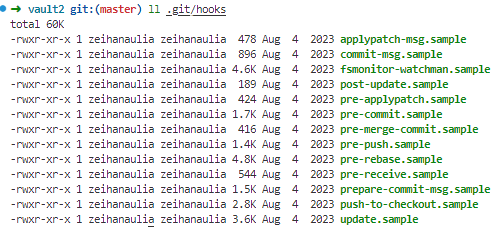

## Apa itu git hook?

Git hooks adalah skrip yang secara otomatis dijalankan oleh Git pada saat terjadi event tertentu di dalam proses pengelolaan repository. Git hooks memungkinkan Anda untuk menyesuaikan atau memperluas fungsionalitas Git dengan menjalankan skrip khusus yang Anda buat. Skrip ini berguna untuk mengotomatisasi tugas, seperti validasi kode, format ulang, atau deployment otomatis.

## Bagaimana cara kerjanya?

Seperti yang kita tau, ada beberapa event pada git seperti `git commit`, `git push` atau `git merge`. Setiap event ini secara default akan mencari file hook pada directory `.git/hook`.
Kita bisa menambahkan file hook sesuai dengan event yang berisi task yang mau dilakukan sebelum atau sesudah melakukan event pada git. Secara default git sudah menyediakan template example



Sample diatas bisa kita copy dan mengilangkan `.sample` agar hook berkerja.

```sh
cp .git/hooks/commit-msg.sample .git/hooks/commit-msg 
chmod +x .git/hooks/*
```

Command diatas, akan mengcopy hooks commit-msg, dalamnya sudah ada script pengecekan

```sh
#!/bin/sh
#
# An example hook script to check the commit log message.
# Called by "git commit" with one argument, the name of the file
# that has the commit message.  The hook should exit with non-zero
# status after issuing an appropriate message if it wants to stop the
# commit.  The hook is allowed to edit the commit message file.
#
# To enable this hook, rename this file to "commit-msg".

# Uncomment the below to add a Signed-off-by line to the message.
# Doing this in a hook is a bad idea in general, but the prepare-commit-msg
# hook is more suited to it.
#
# SOB=$(git var GIT_AUTHOR_IDENT | sed -n 's/^\(.*>\).*$/Signed-off-by: \1/p')
# grep -qs "^$SOB" "$1" || echo "$SOB" >> "$1"

# This example catches duplicate Signed-off-by lines.

test "" = "$(grep '^Signed-off-by: ' "$1" |
         sort | uniq -c | sed -e '/^[   ]*1[    ]/d')" || {
        echo >&2 Duplicate Signed-off-by lines.
        exit 1
}
```


## 
